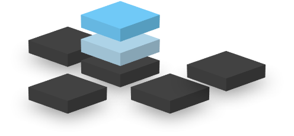

QEDlib
#################

:Release: |release|
:Date: |today|

QEDlib is a Python library for expressively defining distributed
hybrid classical / quantum computing tasks in a cloud environment.

|LOGO|

.. raw:: html

    <h2 style="margin-top:0px;">Features</h2>

* An open-source software architecture for **hybrid quantum computing**

..

* The heart of a quantum **cloud-native** programming and orchestration platform, implemented in Python, Rust and more.
